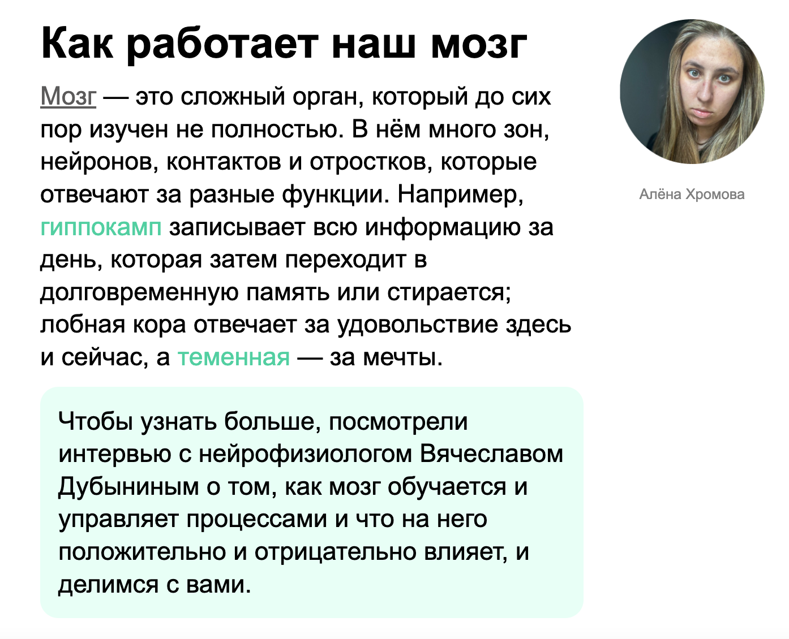

# Задание Введение в вёрстку

Вы работаете в редакции научно-популярного онлайн-журнала. Перед вами стоит задача сверстать небольшой блок статьи для публикации на сайте. В редакцию поступил сырой текстовый материал, но он оформлен без тегов и нужных классов.

Ваша задача — превратить этот текст в аккуратную и структурированную веб-страницу

## Инструкция по выполнению работы

### Работа в CodePen
1. Перейдите по ссылке на [Codepen](https://codepen.io/Netology/pen/KwdjGoy).
2. Нажмите кнопку **Fork**.
3. Выполните домашнее задание.
4. Нажмите кнопку **Save**.

### Работа в JSBin
1. Создайте новый bin в своем аккаунте.
2. Скопируйте исходную разметку в HTML-вкладку.
3. Подключите заготовленные стили через тег link - ссылка
4. Выполните задание.
5. Нажмите **Save snapshot**.

## Инструкция

## Этап 1. HTML

1. **Заголовок внутри div с классом content**
  Текст **«Как работает наш мозг»** оформить при помощи тега h1. Задайте ему класс title

2. **Первый абзац внутри div с классом content**
  Оформите первый абзац при помощи тега p с классом text
  Внутри первого абзаца:
    - слово **«Мозг»** сделайте ссылкой с классом link, ссылка должна вести на статью -[https://ru.wikipedia.org/wiki/%D0%9C%D0%BE%D0%B7%D0%B3](https://ru.wikipedia.org/wiki/%D0%9C%D0%BE%D0%B7%D0%B3)
    - слова **«гиппокамп»** и **«теменная»** выделить при помощи тега span с классом note

3. **Второй абзац внутри div с классом content**
  Оформите второй абзац при помощи тега p с классом text-green-bkg

4. **Картинка внутри div с классом author-wrp**
    Вставить фотографию автора через тег img с классом author и alt Алёна Хромова. Вставьте в src ссылку на картинку [https://netology.ru/blog/images/tild3836-3335-4533-b135-313531643533__photo.png](https://netology.ru/blog/images/tild3836-3335-4533-b135-313531643533__photo.png)
    Задайте абзацу с контентом **Алёна Хромова** класс autor-name
   
## Этап 2. CSS

### Добавьте стили для всей страницы через селектор `body`:
- шрифт: `Arial, serif`
- размер текста: `28px`
- межстрочный интервал: `36px`

---

### Добавьте стили для заголовка через селектор `.title`
- размер: `48px`
- межстрочный интервал: `52px`

---

### Добавьте стили для ссылки через селектор `.link`
- цвет: `#5b5a5a`

---

### Добавьте стили для выделения слов через селектор `.note`
- цвет: `#4bd0a0`

---

### Добавьте стили для абзаца с зелёным фоном при через селектор `.text-green-bkg`
- фон: `#e7fff6`

---

### Добавьте стили для абзаца  Абзац c именем автора через селектор `.autor-name`
- размер: `16px`
- межстрочный интервал: `18px`
- цвет: `#808080`

## Критерии проверки
1.  Работы соответствовуют принятому стилю кода для [HTML](https://github.com/netology-code/codestyle/tree/master/html) и [CSS](https://github.com/netology-code/codestyle/tree/master/css)
2. Задание выполнено в codepen или jsBin
3. Выполнены все пункты задания
4. Отсутствует лишний css (вне рамок пунктов задания) или html

https://netology-code.github.io/html-2-homeworks/introduction-html-css/css/style-common.css
